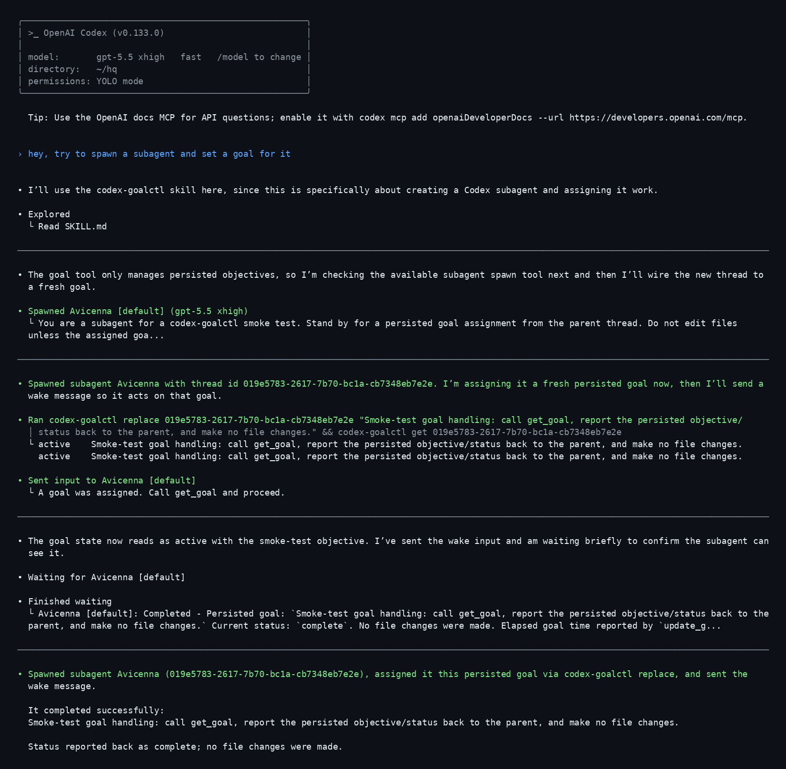

# codex-goalctl

`codex-goalctl` reads and changes persisted Codex thread goals.

Use it when one session, script, or agent needs to inspect or assign durable
goal state for another Codex thread. It does not start agents, send chat
messages, or send wake messages.

Each command starts a short-lived stdio app-server internally, so there is no
shared server to manage for normal use.

## Install

From the `ferrumctl` root:

```sh
uv tool install ./packages/codex-goalctl
```

From this package directory:

```sh
uv tool install .
```

## Examples

Set a fresh goal with reset counters:

```sh
codex-goalctl replace THREAD_ID "Review this package and mark the goal complete."
```

Check or edit the current goal:

```sh
codex-goalctl get THREAD_ID
codex-goalctl update THREAD_ID "same goal, new wording"
codex-goalctl update THREAD_ID --status paused
codex-goalctl clear THREAD_ID
```

Goal writes do not reliably wake a CLI-owned thread. Send a normal follow-up
message, or use `codex-wakectl send` when the worker is app-server-backed:

```text
A goal was assigned. Call get_goal and proceed.
```

Use `--json` when another program will parse output.

More detail:

- [docs/goal-lifecycle.md](docs/goal-lifecycle.md)
- [docs/app-server-boundaries.md](docs/app-server-boundaries.md)

## Codex Skill

Install the optional skill when Codex should know when to use this command:

```sh
codex plugin marketplace add ustas-eth/ferrumctl
codex plugin add codex-goalctl@ferrumctl
```

The skill lives at `plugins/codex-goalctl/skills/codex-goalctl/SKILL.md`.

## Screenshot

This screenshot shows a main Codex thread using the skill, spawning a
subagent, assigning a persisted goal, waking the subagent, and receiving the
completed status back.

<p align="center">
  
</p>
